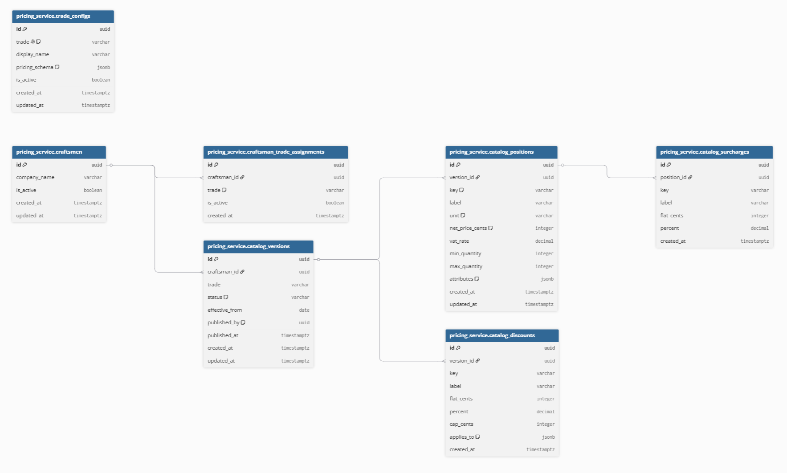

# Design Notes — Pricing Catalog Service

## Status: DRAFT — work in progress

---

## 1. Data Model

### Core entities

- `catalog_versions` — one version per (craftsmanId, trade), status DRAFT or PUBLISHED
- `catalog_positions` — line items belonging to a version
- `catalog_surcharges` — optional add-ons declared per position
- `catalog_discounts` — catalog-level discounts applied at quote time

### Per-trade attribute variability

Trade-specific attributes (e.g. `frameMaterial` for WINDOWS, `heatingPowerKw` for HVAC) will be stored as a `jsonb` column on `catalog_positions`. This avoids a wide sparse table and requires no migration when a new trade is added.

The allowed fields will be defined per trade in `trade_configs.pricing_schema` (also `jsonb`). A validator function will enforce the schema on every draft write.

### Version immutability

Once PUBLISHED, a version and its positions are immutable. Old versions stay readable for audit. Only DRAFTs are mutable.

### Overlapping active intervals

At most one PUBLISHED version per (craftsmanId, trade) at any point in time. Strategy TBD — leaning toward SELECT FOR UPDATE inside a transaction. See §4.

---

## 2. Money Representation

**Decision: integers in minor units (cents)**

Example: 80,00 € stored as `8000`.

Reasoning: floating-point arithmetic produces rounding surprises (`0.1 + 0.2 = 0.30000000000000004`). Integer arithmetic is exact. Only `vatRate` and surcharge `percent` are stored as `decimal` — they are configuration values, not computed amounts.

---

## 3. Quote Evaluation Order (proposed)

1. `lineNet = quantity × netPriceCents`
2. Apply flat surcharges — sum all flat amounts
3. Apply percent surcharges — multiplicative chain
4. Apply catalog discounts in declaration order — percent with cap applied before stacking
5. Group net by `vatRate` — compute VAT per group via `Math.round`
6. Sum totals

Rounding rule: `Math.round()` at every step that produces a fractional cent. Will document a concrete example once implemented.

---

## 4. Concurrency on Publish (TBD)

Three options under consideration:

- Partial unique index `WHERE status = 'PUBLISHED'`
- `SELECT FOR UPDATE` on the version row
- Postgres advisory lock on (craftsmanId, trade)

Decision and reasoning to be added after implementation.

---

## 5. Schema Patch Behavior (TBD)

When `PATCH /trades/:trade` changes `pricingSchema` — reject or drift-mark?

Decision to be added after implementation.

---

## 6. What I plan to cut

TBD — will update after seeing how long the core takes.

---

## 7. AI Usage

TBD — will document after implementation.
